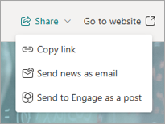

# The news reader in Viva Connections

The News reader provides users with SharePoint news from across the organizational sites, boosted news, user’s followed sites, frequent sites, and people the user works with. News items are presented as news cards in a neat and easy to access immersive reader experience through the News tab. Users can easily Like interesting news, Save news posts to be accessed later, or use Copilot to provide a summary of top news.

> [!NOTE]
>
> - The news reader experience is being rolled out to users that will replace the current Feed experience across desktop, web, and mobile devices. This update is planned to roll out to all customers across all devices by the end of April 2025.
> - The Copilot powered news summary is currently only available through the desktop version of Microsoft Teams and is rolling out to users with a Microsoft 365 Copilot license.

Users can access the news reader by selecting the **News** tab in their Connections experience.

  :::image type="content" source="../media/connections/news-reader/news-tab.png" alt-text="Screenshot of the News tab showing the News card layout." lightbox="../media/connections/news-reader/news-tab.png":::

## Interacting with news cards

When users access the **News** tab, they see their news feed displayed in grid layout on cards. Selecting a card opens the news within the Connections app itself in an immersive reader experience with access to sharing options and the ability to access the news item in the browser.

Users can select the **thumbs up** icon (  ) on a news card to like the news post, or select the **bookmark** icon (  )to save the news post for later reading. Select the **bookmark** icon again to remove the bookmark.

Bookmarked news items can be accessed by selecting **Saved for later** at the top of the News reader experience.

  :::image type="content" source="../media/connections/news-reader/saved-for-later.png" alt-text="Screenshot of the news reader with the saved for later button highlighted.":::

## The Copilot powered news summary

> [!NOTE]
>
> The Copilot powered news summary is currently only available through the desktop version of Microsoft Teams and is rolling out to users with a Microsoft 365 Copilot license.

Users are able to summarize the top news articles in their news feed using the **Summarize top news** button located under the **All** section of the News tab.

When selected, Copilot provides an AI generated summary of top news items in a user’s feed, giving a quick overview of all the latest information.

For more information on Copilot powered news summary and other Copilot features in Connections, see the [Copilot in Viva Connections article](https://support.microsoft.com/topic/44534466-5ded-4310-8d70-4d4116afddf2) and the [Copilot in Viva Connections FAQ](https://support.microsoft.com/topic/b464b3c1-a19e-4496-b9cc-890c6ab56111).

## News reader FAQ

**What news items are shown to a user?**

The news reader is a system driven news feed with SharePoint news posts from the user’s followed sites, frequent sites, trending sites, home site, organization news sites, and news posts published by people they work with.

**Do admin's have any control over the news items shown here?**

News posts published on the home site, organizational news sites, and boosted news are prioritized and  show at the top of the news reader experience.

**Does the news reader feed support audience targeting?**

Yes, news posts are filtered appropriately based on the user’s audience memberships. Additionally, if multilingual news posts are available, the news item for the user’s preferred language is shown.

**Will the Copilot summary work for any language?**

The Copilot summary experience respects the end user’s language and works for all languages found in the [supported languages for Microsoft Copilot](https://support.microsoft.com/office/94518d61-644b-4118-9492-617eea4801d8) article.  

**How can Engage content be shown in Viva Connections now?**

An Engage dashboard card is planned that will replace the existing dashboard card. Specific Engage posts can be pinned through the [Spotlight properties](manage-spotlight.md#pinning-a-link-to-a-content-source). Viva Engage storylines are now natively available in the Microsoft Teams app (for more information, see the blog post on [What’s new in Viva Engage – Ignite Edition](https://techcommunity.microsoft.com/blog/viva_engage_blog/what%E2%80%99s-new-in-viva-engage-%E2%80%93-ignite-edition/4299865).

**Where can I find more information regarding news posts and news link posts?**

Refer to [create and share news on your SharePoint sites](https://support.microsoft.com/office/495f8f1a-3bef-4045-b33a-55e5abe7aed7) and [demystifying SharePoint news](https://support.microsoft.com/office/fe205929-c583-4174-95b4-fe732abc7ac6) for more information.

**Why isn’t boosted news displaying in the news reader?**

It can take up to 24 hours for boosted news created from a [new organization news site](/sharepoint/organization-news-site) to appear.

## Learn More

[Create and share news on your SharePoint sites](https://support.microsoft.com/office/495f8f1a-3bef-4045-b33a-55e5abe7aed7)

[Use the News web part on a SharePoint page](https://support.microsoft.com/office/c2dcee50-f5d7-434b-8cb9-a7feefd9f165)

[Overview of Viva Connections](viva-connections-overview.md)

[Copilot in Viva Connections](https://support.microsoft.com/topic/44534466-5ded-4310-8d70-4d4116afddf2)

[Copilot in Viva Connections FAQ](https://support.microsoft.com/topic/b464b3c1-a19e-4496-b9cc-890c6ab56111)